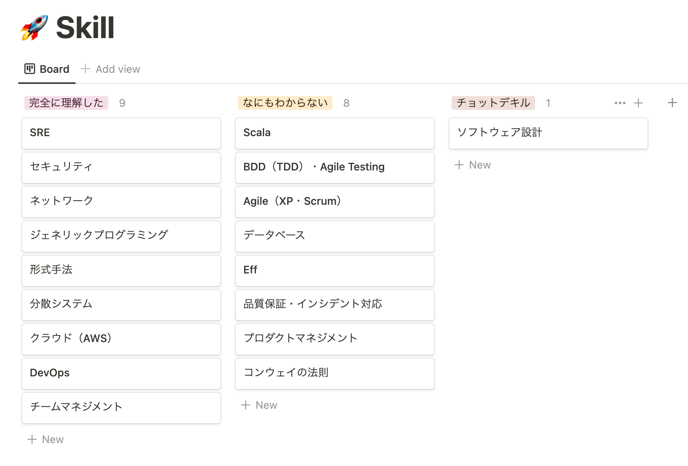

+++
title = "エンジニアとしての強みを整理してみた"
[taxonomies]
tags = [ "Poem" ]
+++

## 経緯

業務で足りていないスキルが多く課題を大きく捉えすぎることで、自分がいま学ぶべきことが整理できていなかったのでエンジニアとしての強みを整理してみた

## 結果

整理した結果は以下のようになった。

## やってみて思ったこと

転職意欲がないからキャリアについて考える機会が少ない。と言っていたが、転職意欲関係なく常日頃からやったほうがよかったなと思った。

学ぶべきことが多いという課題を細かく分割するのを怠っていただけかもしれない。

次にやることは

- 各チケットに対して参考にしたい人を割り当てる
- 各チケットの優先度順に並べる

かな〜と考えているところ。今回はここまで